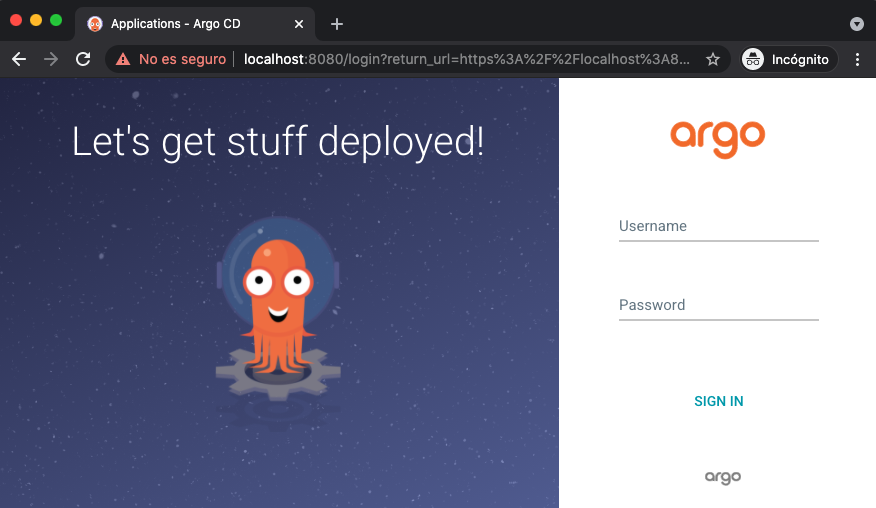
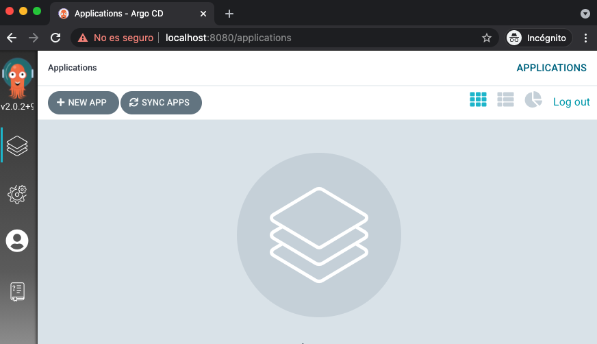

# argocd-kubernetes

Deploy and configure [ArgoCD](https://argoproj.github.io/) within a Kubernetes cluster.

Setup gitOps for an application.

## Prerequisites

1. A **kubernetes cluster** to deploy all elements. You can use one of the following local clusters:
    -  [Minikube](https://minikube.sigs.k8s.io/docs/start/)
    -  Install MacOS Docker-Desktop and configure [Docker-Desktop Local Kubernetes Cluster](https://docs.docker.com/docker-for-mac/#kubernetes) (easiest way for MacOs Users)
    -  [Kind cluster](https://kind.sigs.k8s.io/docs/user/quick-start/)

2. **kubectl** installed and pointing to local cluster context. Installation tutorial [here](https://kubernetes.io/es/docs/tasks/tools/install-kubectl/). Kubectl local context will be available in `~/.kube/config` file.

3. Argocd CLI installed. Installation tutorial [here](https://argo-cd.readthedocs.io/en/stable/cli_installation/).


## 1. Install ArgoCD

In this step, ArgoCD will be installed on Kubernetes in the argocd namespace.

1. Create argocd namespace:
    ```
    kubectl create namespace argocd
    ```
2. Deploy argocd components:
    ```
    kubectl apply -n argocd -f argocd/argocd-manifests.yaml
    ```

Deployed components can be seen:
```
$ kubectl get pods -n argocd

NAME                                  READY   STATUS    RESTARTS   AGE
argocd-application-controller-0       1/1     Running   0          24h
argocd-dex-server-9dc558f5-jmmv2      1/1     Running   0          24h
argocd-redis-759b6bc7f4-86pmn         1/1     Running   0          24h
argocd-repo-server-5fbf484547-n2ghr   1/1     Running   0          24h
argocd-server-6d4678f7f6-qmm7f        1/1     Running   0          24h
```

## 2. Access ArgoCD UI

ArgoCD API Server can be exposed via [**port-forward**](https://kubernetes.io/docs/tasks/access-application-cluster/port-forward-access-application-cluster/) (mapping the pod application port to a local port), to access the service via `localhost:port`. 

> Note: This is the easiest way to expose a service locally. Another options to expose services involve using ingresses, Nodeport/LoadBalancer services, etc. More information about accesing apps in a cluster [here](https://kubernetes.io/docs/tasks/access-application-cluster/).

```
kubectl port-forward svc/argocd-server -n argocd 8080:443
```

ArgoCD will be available at http://localhost:8080.



Initial admin credentials are stored under the secret `argocd-initial-admin-secret` in the argocd namespace. Retrieve the `admin` password with:
```
kubectl get secrets -n argocd argocd-initial-admin-secret -o jsonpath={.data.password} | base64 --decode
```
Once logged, ArgoCD is ready to configure Apps!



## 3. Register Kubernetes Clusters to deploy Apps

In order to register a cluster to deploy Apps on it, the following steps are required:

1. Login to ArgoCD via CLI (same user and credentials from UI):
    ```
    argocd login localhost:8080
    ```
2. Retrive the desired cluster context with:
    ```
    kubectl config get-contexts -o name
    ```
3. Register the cluster (docker-desktop in this tutorial):
    ```
    argocd cluster add docker-desktop
    ```

## 4. Create New App

In the UI, Click on `+ NEW APP` button and enter the following values:
- **Application Name**: nginx
- **Project**: default
- **Sync Policy**: Automatic
- **Repository URL**: https://github.com/alejandrolr/argocd-kubernetes.git
- **Revision**: HEAD
- **Path**: helm-clinic-app
- **Cluster URL**: https://kubernetes.docker.internal:6443
- **namespace**: default